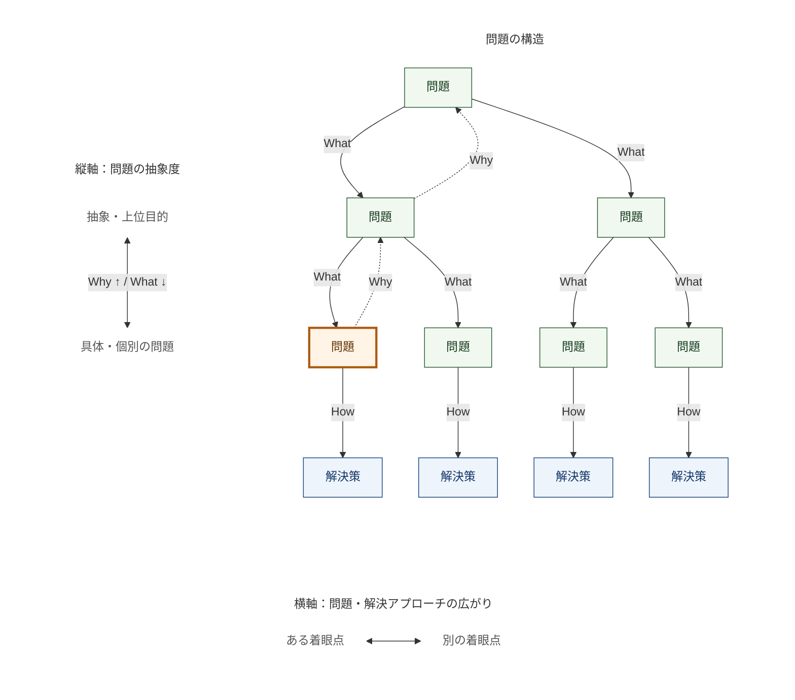

依頼主の提案や質問、決まった仕様をそのまま受け入れるのではなく、問題の本質を理解した上で適切な解決先を見つける必要がある。

まず初めに、問題というのは、依頼主の観点になって考えることが重要である。
そもそも、依頼主が感じているペインや悩みというのは、ある問題の断片を周辺事象として依頼主が探知したセンサー情報である。
そのため、依頼主が緊急性を感じて課題依頼してきたからといって、一概に全て対処すべき問題ではないことがある。

特に、一つの具体的な問題の解消にかける時間やコストが、依頼主のビジネスにとって見合う価値があるのかを検討する必要がある。
ここでいうコストというのは、短期的に消費するリソースだけを指すのではない。将来的に別の課題を解く際に、既存の解決策とコンフリクトしたり、解決策の再利用性が低下することも含まれる。（オーバーエンジニアリングも含む）
小さなコストを払って、ビジネス上重要な課題を解けることがベストであり、大きなコストを払って、ビジネス上重要でない課題を解くことは避けるべきである。
可逆性の低い意思決定（例えば、テーブルの作成）をする場合は特に気をつける。

レバレッジの効く解決策を見つけるためには、『具体的思考』と『抽象的思考』とそれぞれの問題解決のベクトルを知っておく必要がある。
Whatという問いは、目的の達成を妨げる具体的な問題や、その問題を引き起こす要因を捉えるために使う。Howという問いは、その問題への解決策を考えるために使う。これらを、問題や解決策の具体性を高める思考として扱う。
そして、Whyという問いは、問題の抱える『現実と理想のギャップ』に対して、問題の向かう理想の解像度を上げ、問題解決の先にある将来の目的像を明確にすることに向いている。これを抽象的思考と呼ぶ。

問題への『なぜ（日本語）』という問いは、２つの意味があることをおさえておく必要がある。
- なぜ＝Why（抽象的思考）: なぜ、それが問題なのか？なぜ、それを解決する必要があるのか？
- なぜ＝What make it cause（具体的思考）: 何が、その問題を引き起こしているのか？

どちらも問題解決において必要な手法である一方で、トレード・オフの関係にある。
例えば、
具体的に考えることは、より専門的でテクニカルな問いに対して精緻な解を導くことができる。それは、依頼主が抱えるペインの時系列的な背景や出来事の因果関係を理解し、表層的な解にとどまらず、根本的な解決策を導くことができるからである。一方、具体的な見方というのは、往々にして解決する側の視野を狭め、依頼主が抱えるペインの全体像を引き出すことが難しくなり、限定的な問題に対して有効な一方、ベストな解決策を導くことが難しくなる。
抽象的に考えることは、依頼主が抱えるペインの全体像・依頼の目的を把握し、本質的な問題解決の方向性へ転換・導くことができる。それは、一つ上の段から問題を見渡すことで、新たに複数のwhatとhowを発見・検討することができるようになるからである。一方、抽象的な見方というのは、往々にして問題の規模を過度に大きく見積ってしまうため、原因を一口に特定しづらくなり、表層的または実現可能性の低い解決策となってしまうことがある。

## 問題の構造と、解決策を探す方向

問題をツリー構造として整理すると、いま考えている問題の位置と、ほかに検討できる方向を把握しやすい。

- **縦軸：問題の抽象度**。上ほど上位目的に関わる問題、下ほど具体的な問題・解決策を表す。
- **横軸：問題・解決アプローチの広がり**。異なる枝は、同じ目的に対する別の着眼点を表す。

この図は思考の方向を表す概念図であり、上下左右の位置や距離は、解の優劣や効果の大きさを表さない。

- **Why**：「何のために、この問題を解くのか？」と問い、問題から上位の問題へ登る。
- **What（What make it cause）**：「その目的の達成を、具体的に何が妨げているのか？」と問い、問題から下位の問題へ降りる。原因を調べる場合も、仮説と確認できた事実を分ける。
- **How**：「この問題を、どう解くのか？」と問い、末端の問題から解決策へ進む。

末端とは、今回は解決策を比較できる具体性まで分解した問題を指す。必要に応じて、さらに分解したり、上位の問題へ戻ったりしてよい。

オレンジ枠は、最初に気づいた問題を表す。点線は、そこからWhyで上位の問題へ戻る経路の一例であり、ほかの枝からも同じように登れる。戻った先から別の枝をWhatで降り、Howで解決策を検討する。

一つの問題を具体化して解決策を磨くと、その範囲で有効な案を見つけやすくなる。一方、その枝だけを検討していると、同じ目的をより小さな負担で達成できる別のアプローチを見落とすことがある。Whyで上位目的に戻り、別の問題をWhatで具体化し、Howで解決策を考える。この往復によって、比較できる候補を広げる。

局所最適から抜け出すという比喩で捉えるなら、一つの枝の中で改善を続けるだけでなく、検討する枝そのものを見直す動きに当たる。ただし、この図の高さは目的関数の値ではなく抽象度であり、上へ登ること自体が、より良い解や全体最適を保証するわけではない。

### 例：入力作業を速くしたい

「申請フォームの入力に時間がかかる」という問題から始めたとする。そのまま具体化すれば、入力補完や操作性の改善を考えられる。

Whyで「何のために入力を速くしたいのか？」と登ると、「申請から承認までの所要時間を短くしたい」という上位目的が見えるかもしれない。そこからWhatで業務全体を見直すと、次のような別の問題も候補になる。

| 着眼点（What） | 解決策の候補（How） |
| --- | --- |
| 一つひとつの入力操作に時間がかかる | 入力補完や画面操作を改善する |
| 別システムにある情報を二重入力している | 既存データを再利用し、入力自体を減らす |
| 申請後の承認待ちに時間がかかる | 必要な確認を保ちながら、承認の順序や担当を見直す |

これらは調査で確かめる候補であり、二重入力や承認待ちが実際にあるとは限らない。各工程の所要時間と制約を確認し、共通の目的に対する効果、実行コスト、将来の変更負担を比較する。入力改善が有効ならその案を選び、別の工程に大きな負担があれば、そちらを改善する案や組み合わせを検討する。

往復の深さや候補を広げる範囲は、意思決定の影響と検討コストに合わせる。目的・制約と有力な選択肢を比較できるところまで整理できたら、実行する範囲と、判断を見直す条件を決める。

### 例：「〇〇を可視化したい」

「〇〇を可視化したい」という要望を受けたら、その背景には「分析したいこと」があり、その分析にも「達成したい上位目的」があると捉える。

**可視化したい → なぜなら、〇〇を分析したいから → なぜなら、その分析を通じて〇〇を達成したいから（上位目的）**

可視化は分析のための手段であり、分析は判断や行動を通じて上位目的を達成するための手段である。グラフの種類や表示項目を決める前に、Whyで「何を分析したいのか」「なぜ、その分析が必要なのか」「分析結果を使って、誰が何を判断・実行したいのか」をたどり、その先で解消したいペインと達成したい目的を明らかにする。

例えば、「問い合わせの対応状況を可視化したい」という要望の背景には、次のような目的のつながりがあるかもしれない。

1. 問い合わせの対応状況を可視化したい。
2. なぜなら、どの案件や工程で対応が滞っているかを分析したいから。
3. なぜなら、担当や優先順位を見直し、必要な支援をしたいから。
4. なぜなら、対応の遅れを減らし、顧客の待ち時間を短くしたいから。

この場合、本来のペインは「対応の滞留に気づけず、支援が遅れて顧客を待たせていること」かもしれない。このつながりを依頼主の具体的な経験から確かめ、推測のまま目的や問題を決めつけない。

上位目的が見えたら、What（What make it cause）で、滞留に気づけないのか、気づいても優先順位を判断できないのか、判断しても担当を変更できないのかを具体化する。

その上で、**この上位目的を達成するために、可視化システムを作るべきか**を検討する。想定する可視化が必要な分析を支え、その分析結果が実際の判断・行動につながり、ペインの解消にどれだけ寄与するかを確認する。得られる価値を、開発・運用・将来の変更にかかるコストと比較する。

Howの候補には、新しい可視化システムの開発に加えて、既存ツールでの集計・分析、期限超過前の通知、案件の振り分け方法の見直しなども含める。上位目的への効果とコストから、可視化システムを作る、小さな仕組みから始める、別の手段を選ぶといった判断につなげる。

## ユースケース検討へ引き継ぐ

要求分析やユースケースの検討へ進むときは、すでに整理した次の情報を短く渡す。新しい資料を一式作る必要はない。

- 誰がどんな場面で困り、何を達成したいか。その根拠となる具体例。
- 今回解く範囲と制約、選んだ解決の方向、対象外。
- 判断を左右する仮説と未確認事項。事実として確かめたこととは分ける。

業務の言葉や関係を明らかにする必要があれば `domain-modeling` へ、利用目的が見えていれば `use-case-discovery` へ進む。全体の接続が必要な場合は `use-case-design` を使う。
後の発見・記述・レビューで概念や関係が変わることを前提にする。モデルの完成を待たず、解く問題や価値が変わったときに必要な論点へ戻る。
