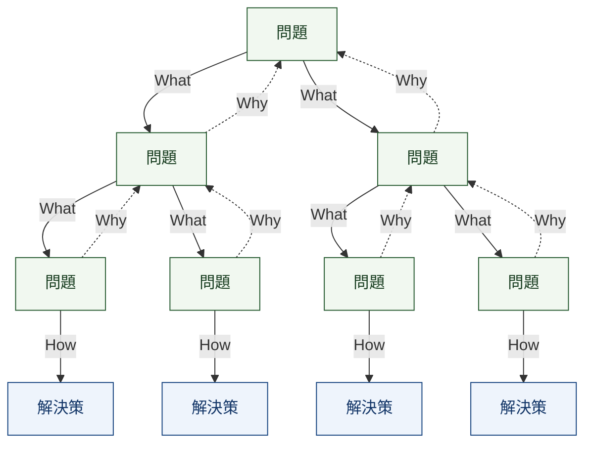

依頼主の提案や質問、決まった仕様をそのまま受け入れるのではなく、問題の本質を理解した上で適切な解決先を見つける必要がある。

まず初めに、問題というのは、依頼主の観点になって考えることが重要である。
そもそも、依頼主が感じているペインや悩みというのは、ある問題の断片を周辺事象として依頼主が探知したセンサー情報である。
そのため、依頼主が緊急性を感じて課題依頼してきたからといって、一概に全て対処すべき問題ではないことがある。

特に、一つの具体的な問題の解消にかける時間やコストが、依頼主のビジネスにとって見合う価値があるのかを検討する必要がある。
ここでいうコストというのは、短期的に消費するリソースだけを指すのではない。将来的に別の課題を解く際に、既存の解決策とコンフリクトしたり、解決策の再利用性が低下することも含まれる。
小さなコストを払って、ビジネス上重要な課題を解けることがベストであり、大きなコストを払って、ビジネス上重要でない課題を解くことは避けるべきである。
可逆性の低い意思決定（例えば、テーブルの作成）をする場合は特に気をつける。

レバレッジの効く解決策を見つけるためには、『具体的思考』と『抽象的思考』とそれぞれの問題解決のベクトルを知っておく必要がある。
問題に対するWhatやHowといった問いは、問題へのスコープを絞り、過去に起こった事象を分析することに向いている。これを具体的思考と呼ぶ。
そして、Whyという問いは、問題の抱える『現実と理想のギャップ』に対して、問題の向かう理想の解像度を上げ、問題解決の先にある将来の目的像を明確にすることに向いている。これを抽象的思考と呼ぶ。

問題への『なぜ（日本語）』という問いは、２つの意味があることをおさえておく必要がある。
- なぜ＝Why（抽象的思考）: なぜ、それが問題なのか？なぜ、それを解決する必要があるのか？
- なぜ＝What makes it cause（具体的思考）: なぜ、その問題が引き起こされたのか?

どちらも問題解決において必要な手法である一方で、トレード・オフの関係にある。
例えば、
具体的に考えることは、より専門的でテクニカルな問いに対して精緻な解を導くことができる。それは、依頼主が抱えるペインの時系列的な背景や出来事の因果関係を理解し、表層的な解にとどまらず、根本的な解決策を導くことができるからである。一方、具体的な見方というのは、往々にして解決する側の視野を狭め、依頼主が抱えるペインの全体像を引き出すことが難しくなり、限定的な問題に対して有効な一方、ベストな解決策を導くことが難しくなる。
抽象的に考えることは、依頼主が抱えるペインの全体像・依頼の目的を把握し、本質的な問題解決の方向性へ転換・導くことができる。一方、抽象的な見方というのは、往々にして問題の規模を過度に大きく見積ってしまうため、原因を一口に特定しづらくなり、表層的または実現可能性の低い解決策となってしまうことがある。

問題をツリー構造として整理するとより現状を把握しやすい。

問題の構造

- **What makes it cause**：問題から下位の問題へ降りる。
- **Why**：問題から上位の問題へ登る。
- **How**：末端の問題から解決策へ進む。

抽象的な思考というのは、さまざまな問題に対して別角度からさまざまなアプローチを提供してくれる。そうした中で、どの課題をどのレベルの具体性まで落とし込んだ上で解くべきなのかを、各解決策ごとのROIや実行することによって生じるトレードオフを考慮しながら、ベストな解決策を導く必要がある。問題解決のベクトルを意識して、どちらの思考を使うべきかを判断する必要がある。
